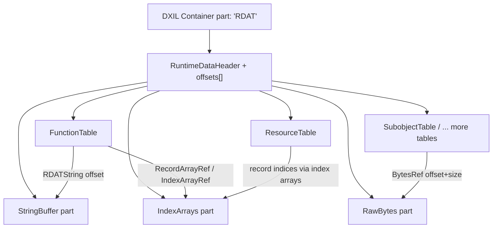

# DXIL Runtime Data (RDAT) Format

RDAT ("Runtime Data") is a compact, self-describing binary blob emitted by DXC
that carries reflection-style metadata about a compiled DXIL library or shader.
It is designed to be consumed at runtime (by a driver/runtime) without needing
to parse the LLVM bitcode, and it is engineered for forward and backward
compatibility so that newer compilers can add data that older consumers safely
ignore, and newer consumers can read older blobs.

This document describes:

- [What RDAT is and how it is used](#overview)
- [The high-level structure](#high-level-structure)
- [The binary encoding in detail](#binary-encoding)
- [The part types](#part-types)
- [The record/field reference model](#record-and-field-reference-model)
- [Versioning and compatibility](#versioning-and-compatibility)
- [The record schemas](#record-schemas)
- [Reading and validation](#reading-and-validation)

The primary sources for this description are:

- [include/dxc/DxilContainer/DxilRuntimeReflection.h](../include/dxc/DxilContainer/DxilRuntimeReflection.h) — readers, headers, context
- [include/dxc/DxilContainer/DxilRuntimeReflection.inl](../include/dxc/DxilContainer/DxilRuntimeReflection.inl) — parsing/validation implementation
- [include/dxc/DxilContainer/RDAT_Macros.inl](../include/dxc/DxilContainer/RDAT_Macros.inl) — the X-macro metaprogramming that defines all record layouts
- [include/dxc/DxilContainer/RDAT_LibraryTypes.inl](../include/dxc/DxilContainer/RDAT_LibraryTypes.inl), [RDAT_SubobjectTypes.inl](../include/dxc/DxilContainer/RDAT_SubobjectTypes.inl), [RDAT_PdbInfoTypes.inl](../include/dxc/DxilContainer/RDAT_PdbInfoTypes.inl) — the actual record definitions
- [include/dxc/DxilContainer/DxilRDATBuilder.h](../include/dxc/DxilContainer/DxilRDATBuilder.h) and [lib/DxilContainer/DxilRDATBuilder.cpp](../lib/DxilContainer/DxilRDATBuilder.cpp) — the writer
- [include/dxc/DxilContainer/DxilRDATParts.h](../include/dxc/DxilContainer/DxilRDATParts.h) — the part builders

---

## Overview

### Where RDAT lives

RDAT is stored as a single part inside a DXIL container, identified by the
FourCC `DFCC_RuntimeData` = `'RDAT'` (see
[DxilContainer.h](../include/dxc/DxilContainer/DxilContainer.h)). The DXIL
container writer adds it via:

```cpp
writer.AddPart(DFCC_RuntimeData, pRDATWriter->size(),
               [&](AbstractMemoryStream *pStream) { pRDATWriter->write(pStream); });
```

Within that container part, RDAT is *itself* a mini-container with its own
header, offset table, and sub-parts. The comment on `DxilRDATBuilder`
summarizes it well:

> Like DXIL container, RDAT itself is a mini container that contains multiple
> RDAT parts.

### What it contains

RDAT primarily describes, for a library or shader:

- **Resources** used (SRV/UAV/CBuffer/Sampler), including register binding,
  space, kind and resource flags.
- **Functions / entry points**: name, unmangled name, shader kind, resources
  referenced, functions called (dependencies), feature/shader-stage flags,
  minimum shader target, payload/attribute sizes, and (v1.8+) stage-specific
  information.
- **Subobjects** (RDAT v1.4+): state object config, root signatures, hit
  groups, raytracing shader/pipeline configs, associations.
- **Node shader information** (v1.8+): launch type, node I/O, node attributes
  for work graphs.
- **Per-stage signature/pipeline info** (experimental): VS/PS/HS/DS/GS/CS/MS/AS
  info, signature elements, ViewID masks, thread group sizes, etc.
- **PDB info** (a separate group): embedded sources, libraries, compile
  arguments, hashes.

### How it is used

- **Runtime/driver reflection**: A runtime can load the blob with
  `DxilRuntimeData` and query typed record tables without parsing bitcode.
- **Subobject loading**: `LoadSubobjectsFromRDAT`
  ([RDATDxilSubobjects.cpp](../lib/DxilContainer/RDATDxilSubobjects.cpp))
  reconstructs `DxilSubobjects` from the subobject table for RDXR/state object
  creation.
- **Validation**: The validator re-checks the structure; `DxilRuntimeData::Validate()`
  bounds-checks every reference.
- **Tooling/debug**: `RDATDumper` ([RDATDumper.cpp](../lib/DxilContainer/RDATDumper.cpp))
  produces a human-readable dump.

---

## High-level structure

An RDAT blob is laid out as follows:

```
+-------------------------------------------------------------+
| RuntimeDataHeader                                           |  8 bytes
|   uint32_t Version                                          |
|   uint32_t PartCount                                        |
+-------------------------------------------------------------+
| uint32_t PartOffsets[PartCount]                            |  4 * PartCount bytes
|   (each offset is relative to the start of the header)     |
+-------------------------------------------------------------+
| Part 0                                                      |
|   RuntimeDataPartHeader { Type, Size }                     |  8 bytes
|   byte Data[ALIGN4(Size)]                                  |
+-------------------------------------------------------------+
| Part 1 ...                                                  |
| ...                                                         |
+-------------------------------------------------------------+
```

Each part is one of a small set of "kinds": the **string buffer**, the **index
array buffer**, the **raw bytes buffer**, or a **record table** (many of these,
one per record type). Records inside tables never store variable-length data
inline; instead they store 4-byte *offsets/indices* into the string, index, or
raw-bytes parts. This is what keeps records fixed-size and strided, enabling
forward/backward compatibility.



---

## Binary encoding

All multi-byte integers are little-endian (matching the rest of the DXIL
container format and the target platforms). All sizes and offsets described as
"4-byte aligned" are padded up with `PSVALIGN4(x) = (x + 3) & ~3`.

### `RuntimeDataHeader`

Defined in [DxilRuntimeReflection.h](../include/dxc/DxilContainer/DxilRuntimeReflection.h).

| Offset | Type       | Field      | Description                                          |
|-------:|------------|------------|------------------------------------------------------|
| 0      | `uint32_t` | `Version`  | RDAT format version. Currently `RDAT_Version_10 = 0x10`. |
| 4      | `uint32_t` | `PartCount`| Number of parts that follow.                         |
| 8      | `uint32_t[PartCount]` | (offsets) | Offset of each part, **relative to the start of this header**. Offsets are 4-byte aligned. |

Size: `8 + 4 * PartCount` bytes. The value `0x10` for the version was chosen so
it "cannot be mistaken for a part count from the prerelease version" — old blobs
started with a raw part count, so `0x10` disambiguates.

### `RuntimeDataPartHeader`

Each part begins (at its offset) with:

| Offset | Type                   | Field  | Description                                            |
|-------:|------------------------|--------|--------------------------------------------------------|
| 0      | `RuntimeDataPartType` (`uint32_t`) | `Type` | Identifies which kind of part this is.     |
| 4      | `uint32_t`             | `Size` | Size of the part data **not** including this header. Must be 4-byte aligned. |
| 8      | `byte[ALIGN4(Size)]`   | (data) | Part payload.                                          |

The writer always stores `Size = PSVALIGN4(actualPartSize)`, and empty parts
(size 0) are omitted entirely (see `ComputeSize` / `FinalizeAndGetData` in
[DxilRDATBuilder.cpp](../lib/DxilContainer/DxilRDATBuilder.cpp)).

### Overall size computation

From `DxilRDATBuilder::ComputeSize`:

```
total = sizeof(RuntimeDataHeader)              // 8
      + numNonEmptyParts * sizeof(uint32_t)    // offset table
      + Σ (sizeof(RuntimeDataPartHeader) + PSVALIGN4(part.GetPartSize()))
```

Only non-empty parts contribute; the header's `PartCount` equals
`numNonEmptyParts`.

### Writing order

The writer instantiates parts in the specific order the validator expects
(from `DxilRDATWriter`'s constructor):

1. `StringBuffer`
2. `ResourceTable`
3. `FunctionTable`
4. `IndexArrays`
5. `RawBytes`
6. `SubobjectTable` (if allowed by validator version)
7. Remaining tables in declaration order (only those `<= maxAllowedType`)

Ordering matters only for producing a byte-identical, validator-friendly layout;
readers locate parts by `Type` via the offset table, not by position.

---

## Part types

`RuntimeDataPartType` (a `uint32_t` enum) enumerates every part kind. The
non-table kinds are the shared buffers; the rest are record tables.

| Value  | Name                        | Introduced | Notes                                    |
|-------:|-----------------------------|:----------:|------------------------------------------|
| 0      | `Invalid`                   | —          |                                          |
| 1      | `StringBuffer`              | 1.3        | Shared UTF-8 string pool                 |
| 2      | `IndexArrays`               | 1.3        | Shared array-of-uint32 pool              |
| 3      | `ResourceTable`             | 1.3        | `RuntimeDataResourceInfo` records        |
| 4      | `FunctionTable`             | 1.3        | `RuntimeDataFunctionInfo[2]` records; `Last_1_3` |
| 5      | `RawBytes`                  | 1.4        | Shared raw byte pool                     |
| 6      | `SubobjectTable`            | 1.4        | `Last_1_4`                               |
| 7      | `NodeIDTable`               | 1.8        |                                          |
| 8      | `NodeShaderIOAttribTable`   | 1.8        |                                          |
| 9      | `NodeShaderFuncAttribTable` | 1.8        |                                          |
| 10     | `IONodeTable`               | 1.8        |                                          |
| 11     | `NodeShaderInfoTable`       | 1.8        | `Last_1_8`                               |
| 12     | `Reserved_MeshNodesPreviewInfoTable` | —  | reserved                        |
| 13+    | `SignatureElementTable`, `VSInfoTable`, `PSInfoTable`, `HSInfoTable`, `DSInfoTable`, `GSInfoTable`, `CSInfoTable`, `MSInfoTable`, `ASInfoTable` | experimental | **experimental** |

The PDB-info group uses a separate namespace via `RDAT_PART_ID_WITH_GROUP`,
which packs a `RuntimeDataGroup` into the high 16 bits:

```cpp
RDAT_PART_ID_WITH_GROUP(group, id) = ((group << 16) | (id & 0xFFFF))
```

- Group `Core = 0` — all the parts above.
- Group `PdbInfo = 1` — `DxilPdbInfoTable`, `DxilPdbInfoSourceTable`,
  `DxilPdbInfoLibraryTable`.

`RecordTableIndex` is a parallel dense enum used to index the reader's internal
`Tables[]` array; note that its ordering is **not** the same as the numeric
`RuntimeDataPartType` values (e.g. PDB tables are grouped in the middle of
`RecordTableIndex` but have high `RuntimeDataPartType` values).

### StringBuffer part

Type `1`. A flat blob of UTF-8 bytes. The first byte is always `'\0'` so that
offset `0` is a valid empty/null string:

```cpp
StringBufferPart() { Insert(""); }  // offset 0 == ""
```

- References into it are byte **offsets** (`RDATString`, `RDATStringArray`).
- Strings are null-terminated; the reader simply returns `table + offset`.
- Deduplicated on insert via an `unordered_map<string, offset>`.
- Validation requires the last byte to be `0`.

### IndexArrays part

Type `2`. A flat array of `uint32_t`. It stores *many* variable-length index
arrays back to back. Each array is encoded as:

```
[ count ][ value_0 ][ value_1 ] ... [ value_{count-1} ]
```

- A reference (`IndexArrayRef`, and the array-of-refs used by
  `RecordArrayRef`/`RDATStringArray`) is the `uint32_t` **element index** of the
  `count` word.
- `IndexTableReader::getRow(i)` returns a row starting at `table[i]` with length
  `table[i]`, i.e. it reads the count then exposes the following `count` values.
- Arrays are deduplicated: `IndexArraysPart::AddIndex` appends the new array,
  then uses an ordered `std::set` with a custom comparator (`CmpIndices`) that
  compares count-then-elements; on a duplicate it rolls back the append and
  returns the pre-existing offset.
- Part size in bytes = `4 * number_of_uint32_words`.

This one pool is used both for numeric arrays (e.g. `NumThreads`,
`SemanticIndices`, `DispatchGrid`) and for arrays of record indices
(`RecordArrayRef`) and arrays of string offsets (`RDATStringArray`).

### RawBytes part

Type `5`. A flat blob of arbitrary bytes for binary payloads (root signature
blobs, ViewID masks, PDB data, hashes).

- Referenced by `BytesRef { uint32_t Offset; uint32_t Size; }` — an 8-byte
  field embedded in records.
- Deduplicated by content via `unordered_map<string, offset>`.
- Note: unlike the string buffer, there is no implicit leading entry and no
  null terminator; `Size` fully bounds the data.

### Record tables

Types `3, 4, 6, 7…`. Each table part begins with a `RuntimeDataTableHeader`
followed by `RecordCount` fixed-size records:

| Offset | Type       | Field         | Description                                  |
|-------:|------------|---------------|----------------------------------------------|
| 0      | `uint32_t` | `RecordCount` | Number of records.                           |
| 4      | `uint32_t` | `RecordStride`| Size of each record in bytes; 4-byte aligned.|
| 8      | `byte[RecordCount * RecordStride]` | (records) | Packed records. |

Key properties:

- **Strided for extensibility.** `RecordStride` is stored per table so a newer
  compiler can grow a record type (append fields) and older readers still walk
  the table correctly. Readers only read fields that fit within both the
  compiled struct size *and* the stored stride; `TableReader::Row<T>` returns
  `nullptr` if `sizeof(T) > stride`.
- **Deduplication.** When enabled (`m_bDeduplicationEnabled`), identical record
  byte-images alias to the same index via an `unordered_map<string, index>`
  keyed on the raw record bytes. Whether dedup is allowed depends on the module
  (`GetRecordDuplicationAllowed`).
- **Records contain only fixed-size fields**: scalars, enums (stored as their
  underlying integer), fixed arrays, and 4-byte reference handles into the
  shared pools (or the 8-byte `BytesRef`).

`GetPartSize()` returns `0` for an empty table (so it is omitted), otherwise
`sizeof(RuntimeDataTableHeader) + RecordCount * RecordStride`.

---

## Record and field reference model

Records are **plain-old-data** structs generated by the X-macro system in
[RDAT_Macros.inl](../include/dxc/DxilContainer/RDAT_Macros.inl). The same
`.inl` definitions are expanded in multiple modes (`DEF_RDAT_TYPES_BASIC_STRUCT`,
`DEF_RDAT_TYPES_USE_HELPERS`, reader decl/impl, traits, validation, dump) so the
layout, readers, validators, and dumpers all stay in lockstep.

Every field maps to one of these on-disk encodings:

| Macro                         | On-disk size | Encoding                                                        |
|-------------------------------|-------------:|----------------------------------------------------------------|
| `RDAT_VALUE(type, name)`      | `sizeof(type)` | Raw scalar (`uint8/16/32`, etc.).                            |
| `RDAT_VALUE_HEX`              | `sizeof(type)` | Same; hint for dumping in hex.                              |
| `RDAT_ENUM(sTy, eTy, name)`   | `sizeof(sTy)`  | Enum stored in storage type `sTy` (e.g. `uint32_t`/`uint8_t`).|
| `RDAT_FLAGS(sTy, eTy, name)`  | `sizeof(sTy)`  | Bit flags stored in `sTy`.                                  |
| `RDAT_STRING(name)`           | 4 bytes        | `RDATString` = byte offset into StringBuffer.               |
| `RDAT_STRING_ARRAY_REF(name)` | 4 bytes        | `RDATStringArray` = index-array offset; array of string offsets.|
| `RDAT_INDEX_ARRAY_REF(name)`  | 4 bytes        | `IndexArrayRef` = index-array offset; array of `uint32_t`.  |
| `RDAT_RECORD_REF(type, name)` | 4 bytes        | `RecordRef<type>` = record index into that type's table.    |
| `RDAT_RECORD_ARRAY_REF(type, name)` | 4 bytes  | `RecordArrayRef<type>` = index-array offset; array of record indices. |
| `RDAT_RECORD_VALUE(type, name)` | `sizeof(type)` | Nested record embedded inline (by value).                 |
| `RDAT_BYTES(name)`            | 8 bytes        | `BytesRef` = `{ uint32_t Offset; uint32_t Size; }` into RawBytes. |
| `RDAT_ARRAY_VALUE(type,count,...)` | `count*sizeof(type)` | Fixed-size inline array.                          |

The sentinel `RDAT_NULL_REF = 0xFFFFFFFF` denotes a null reference for
record/index/string references.

### Alignment guidance

From the header comment in `RDAT_Macros.inl`:

> Pay attention to alignment when organizing structures. `RDAT_STRING` and
> `*_REF` types are always 4 bytes. `RDAT_BYTES` is 2 × 4 bytes.

Because `RecordStride` must be 4-byte aligned and records are packed with C
struct layout, field order in the `.inl` definitions is chosen to avoid internal
padding surprises. `uint8_t`/`uint16_t` fields are grouped so the record packs
cleanly.

### Unions

Records may contain a `union` (`RDAT_UNION` … `RDAT_UNION_END`) whose active
member is selected by another field (typically a `Kind`/`AttribKind` enum). The
`RDAT_UNION_IF`/`RDAT_UNION_ELIF` predicates (e.g.
`getShaderKind() == ShaderKind::Node`) drive the reader accessors, validation,
and dumping so only the active member is interpreted. On disk this is just a
fixed-size union occupying the size of its largest member.

---

## Versioning and compatibility

RDAT is explicitly built for mixed producer/consumer versions:

- **Blob version** — `RuntimeDataHeader.Version` (`0x10`). Readers reject
  anything below `RDAT_Version_10`.
- **Validator-version gating of parts** — `MaxPartTypeForValVer(Major, Minor, IsPrerelease)`
  determines which part types a given validator version may emit:
  - `< 1.3` → `Invalid` (no RDAT at all)
  - `< 1.4` → up to `Last_1_3` (`FunctionTable`)
  - `< 1.8` → up to `Last_1_4` (`SubobjectTable`)
  - experimental/prerelease shader model or unbound validator → up to
    `LastExperimental`
  - otherwise → `LastRelease` (`Last_1_8`)

  The writer only instantiates tables whose `PartType() <= maxAllowedType`.
- **Record growth via stride** — Because each table records its `RecordStride`,
  a record type can be *extended* by appending fields. Two mechanisms cooperate:
  - **Derived records**: `RDAT_STRUCT_TABLE_DERIVED(type, base, table, Major, Minor)`
    defines a record that inherits a base and adds fields, sharing the base's
    table (e.g. `RuntimeDataFunctionInfo2` derives from
    `RuntimeDataFunctionInfo` and requires validator 1.8). The table's stride is
    bumped to the largest supported derived type. Readers upcast based on stride.
  - A static assert enforces the core assumption: a derived record type must be
    strictly larger than its base (`sizeof(derived) > sizeof(base)`), so stride
    comparisons unambiguously indicate which fields are present.
- **Forward-compatible reads** — `TableReader::Row<T>()` returns `nullptr` when
  `sizeof(T) > stride`, and record readers invalidate themselves if the stored
  size is smaller than the requested record type. Unrecognized part types are
  simply skipped by the parser (`default: continue;`).

---

## Record schemas

The record definitions live in the `RDAT_*Types.inl` files. Below are the
most important ones with their on-disk field encodings. All `*Ref`/string fields
are 4-byte handles; `RDAT_BYTES` is 8 bytes (`Offset`+`Size`).

### `RuntimeDataResourceInfo` (ResourceTable, v1.3+)

| Field        | Encoding        | Meaning                                        |
|--------------|-----------------|------------------------------------------------|
| `Class`      | `uint32_t` enum | `hlsl::DXIL::ResourceClass` (SRV/UAV/CBuffer/Sampler) |
| `Kind`       | `uint32_t` enum | `hlsl::DXIL::ResourceKind`                      |
| `ID`         | `uint32_t`      | Resource ID within its class                   |
| `Space`      | `uint32_t`      | Register space                                 |
| `LowerBound` | `uint32_t`      | First register                                 |
| `UpperBound` | `uint32_t`      | Last register                                  |
| `Name`       | `RDATString`    | Global name                                    |
| `Flags`      | `uint32_t` flags| `DxilResourceFlag` (UAVCounter, ROV, Atomics64, …) |

### `RuntimeDataFunctionInfo` (FunctionTable, v1.3+)

| Field                   | Encoding                     | Meaning                                  |
|-------------------------|------------------------------|------------------------------------------|
| `Name`                  | `RDATString`                 | Full (mangled) function name             |
| `UnmangledName`         | `RDATString`                 | Unmangled name                           |
| `Resources`             | `RecordArrayRef<ResourceInfo>` | Global resources used                  |
| `FunctionDependencies`  | `RDATStringArray`            | External functions called (by name)      |
| `ShaderKind`            | `uint32_t` enum              | `hlsl::DXIL::ShaderKind`                  |
| `PayloadSizeInBytes`    | `uint32_t`                   | Ray payload / callable param size        |
| `AttributeSizeInBytes`  | `uint32_t`                   | Hit attribute size                       |
| `FeatureInfo1`          | `uint32_t` flags             | Low 32 bits of feature flags             |
| `FeatureInfo2`          | `uint32_t` flags             | High 32 bits of feature flags            |
| `ShaderStageFlag`       | `uint32_t` flags             | Valid shader stages (`DxilShaderStageFlags`) |
| `MinShaderTarget`       | `uint32_t` (hex)             | Encoded minimum shader model target      |

`GetFeatureFlags()`/`SetFeatureFlags()` combine `FeatureInfo1|2` into a 64-bit value.

### `RuntimeDataFunctionInfo2` (FunctionTable, derived, v1.8+)

Extends `RuntimeDataFunctionInfo` with:

| Field                        | Encoding          | Meaning                                        |
|------------------------------|-------------------|------------------------------------------------|
| `MinimumExpectedWaveLaneCount` | `uint8_t`       | 0 = unspecified                                |
| `MaximumExpectedWaveLaneCount` | `uint8_t`       | 0 = unspecified                                |
| `ShaderFlags`                | `uint16_t` flags  | `DxilShaderFlags` (NodeProgramEntry, UsesViewID, …) |
| *union selected by `ShaderKind`* | 4 bytes each  | `RawShaderRef` (uint32) / `RecordRef` to `NodeShaderInfo`, `VSInfo`, `PSInfo`, `HSInfo`, `DSInfo`, `GSInfo`, `CSInfo`, `MSInfo`, `ASInfo` |

The `uint8/uint8/uint16` grouping keeps the added prefix 4-byte aligned before
the 4-byte union.

### Node/work-graph records (v1.8+)

- `NodeID` (NodeIDTable): `Name` (`RDATString`), `Index` (`uint32_t`).
- `RecordDispatchGrid` (inline value): `ByteOffset` (`uint16_t`),
  `ComponentNumAndType` (`uint16_t`, bitfields: bits 0:2 num components,
  bits 2:15 `ComponentType`).
- `NodeShaderFuncAttrib` (NodeShaderFuncAttribTable): `AttribKind`
  (`uint32_t` enum) + union (`RecordRef<NodeID>`, `IndexArrayRef` for
  NumThreads/DispatchGrid/MaxDispatchGrid, or `uint32_t` values) selected by
  `AttribKind`.
- `NodeShaderIOAttrib` (NodeShaderIOAttribTable): `AttribKind` + union
  (record ref, inline `RecordDispatchGrid`, or `uint32_t`).
- `IONode` (IONodeTable): `IOFlagsAndKind` (`uint32_t`, packs
  `NodeIOFlags`+`NodeIOKind`), `Attribs` (`RecordArrayRef<NodeShaderIOAttrib>`).
- `NodeShaderInfo` (NodeShaderInfoTable): `LaunchType` (`uint32_t` enum),
  `GroupSharedBytesUsed` (`uint32_t`), `Attribs`
  (`RecordArrayRef<NodeShaderFuncAttrib>`), `Outputs`/`Inputs`
  (`RecordArrayRef<IONode>`).

### Subobject records (SubobjectTable, v1.4+)

`RuntimeDataSubobjectInfo`:

| Field   | Encoding        | Meaning                              |
|---------|-----------------|--------------------------------------|
| `Kind`  | `uint32_t` enum | `hlsl::DXIL::SubobjectKind`           |
| `Name`  | `RDATString`    | Subobject name                        |
| *union selected by `Kind`* | varies | See below              |

Union members (inline `RDAT_RECORD_VALUE` structs):

- `StateObjectConfig_t`: `Flags` (`uint32_t` `StateObjectFlags`).
- `RootSignature_t`: `Data` (`RDAT_BYTES`) — used for both global and local RS.
- `SubobjectToExportsAssociation_t`: `Subobject` (`RDATString`), `Exports`
  (`RDATStringArray`).
- `RaytracingShaderConfig_t`: `MaxPayloadSizeInBytes`,
  `MaxAttributeSizeInBytes` (`uint32_t` each).
- `RaytracingPipelineConfig_t`: `MaxTraceRecursionDepth` (`uint32_t`).
- `HitGroup_t`: `Type` (`uint32_t` `HitGroupType`), `AnyHit`, `ClosestHit`,
  `Intersection` (`RDATString` each).
- `RaytracingPipelineConfig1_t`: `MaxTraceRecursionDepth` (`uint32_t`),
  `Flags` (`uint32_t` `RaytracingPipelineFlags`).

### Signature / per-stage records (experimental)

- `SignatureElement` (SignatureElementTable): `SemanticName` (`RDATString`),
  `SemanticIndices` (`IndexArrayRef`), `SemanticKind`/`ComponentType`/
  `InterpolationMode` (`uint8_t` enums), `StartRow` (`uint8_t`, `0xFF` = not
  allocated), `ColsAndStream` (`uint8_t` bitfield: cols-1, start col, output
  stream), `UsageAndDynIndexMasks` (`uint8_t` bitfield).
- `VSInfo`/`PSInfo`/`HSInfo`/`DSInfo`/`GSInfo`/`MSInfo`: `RecordArrayRef<SignatureElement>`
  for input/output (and patch-const/prim) signatures, `RDAT_BYTES` ViewID and
  input-to-output masks, plus stage-specific scalars (control-point counts,
  tessellator domain/primitive, primitive topology, max vertex count, etc.).
- `CSInfo`/`ASInfo`: `NumThreads` (`IndexArrayRef`), `GroupSharedBytesUsed`
  (and `PayloadSizeInBytes` for AS).

### PDB info records (PdbInfo group)

- `DxilPdbInfoLibrary` (DxilPdbInfoLibraryTable): `Name` (`RDATString`),
  `Data` (`RDAT_BYTES`).
- `DxilPdbInfoSource` (DxilPdbInfoSourceTable): `Name`, `Content` (`RDATString`).
- `DxilPdbInfo` (DxilPdbInfoTable): `Sources`
  (`RecordArrayRef<DxilPdbInfoSource>`), `Libraries`
  (`RecordArrayRef<DxilPdbInfoLibrary>`), `ArgPairs` (`RDATStringArray`),
  `Hash` (`RDAT_BYTES`), `PdbName` (`RDATString`), `CustomToolchainId`
  (`uint32_t`), `CustomToolchainData` (`RDAT_BYTES`), `WholeDxil` (`RDAT_BYTES`).

---

## Reading and validation

### Parsing (`DxilRuntimeData::InitFromRDAT`)

The parser uses a bounds-checked `CheckedReader` that throws on overrun/overlap:

1. Read `RuntimeDataHeader`; reject `Version < RDAT_Version_10`.
2. Read the `PartCount` offsets.
3. For each part: `Advance(offset)`, read `RuntimeDataPartHeader`, then bound a
   sub-reader to `part.Size` bytes.
4. Dispatch on `part.Type`:
   - `StringBuffer` → init `StringTableReader`.
   - `IndexArrays` → init `IndexTableReader` with `Size/4` words.
   - `RawBytes` → init `RawBytesReader`.
   - Any table type → `InitTable` reads a `RuntimeDataTableHeader` and binds a
     `TableReader(data, RecordCount, RecordStride)`.
   - Unknown → skipped (`default: continue;`).
5. In debug builds, `Validate()` is run automatically.

### Access

`RDATContext` holds the three buffer readers plus a `TableReader` per
`RecordTableIndex`. Typed access is generated per record type:

- `RecordTableReader<T_Reader>` iterates a table; `Row(i)` returns a reader.
- `RecordReader<T>` validates that the stored stride/size is large enough for
  the requested record type before exposing fields; otherwise it becomes a null
  reader.
- Field accessors resolve handles: string offsets → `StringBuffer.Get`, index
  refs → `IndexTable.getRow`, record refs → `Table<T>().Row`, byte refs →
  `RawBytes.Get` with `Size`.

### Validation (`DxilRuntimeData::Validate`)

- The string buffer, if present, must end in `'\0'`.
- Every table is walked; for each record, all references are bounds-checked:
  - `ValidateRecordRef` — index `< table.Count()` (or `RDAT_NULL_REF`).
  - `ValidateIndexArrayRef` — offset in range and the encoded array length fits
    within the remaining index space.
  - `ValidateRecordArrayRef` / `ValidateStringArrayRef` — the index array is
    well-formed and each element is itself a valid record/string ref.
  - `ValidateStringRef` — offset `< StringBuffer.Size()`.
- `RecursiveRecordValidator` re-validates each record at every version up to the
  one supported by the table stride, so extended (derived) fields are checked
  too. A static assert guarantees `sizeof(derived) > sizeof(base)`.

---

## Appendix: Key constants

| Name                 | Value        | Meaning                                    |
|----------------------|--------------|--------------------------------------------|
| `DFCC_RuntimeData`   | `'RDAT'`     | Container FourCC for the RDAT part          |
| `RDAT_Version_10`    | `0x10`       | Current RDAT blob version                   |
| `RDAT_NULL_REF`      | `0xFFFFFFFF` | Null record/index/string reference          |
| `PSVALIGN4(x)`       | `(x+3)&~3`   | 4-byte alignment used for part/record sizes |
| `RuntimeDataGroup::Core` | `0`      | Default part group                          |
| `RuntimeDataGroup::PdbInfo` | `1`    | PDB info part group (packed into high 16 bits) |
